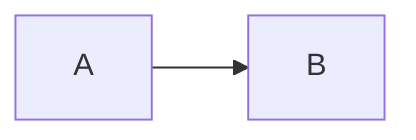

最近在研究通过文本和代码创建图标和可视化，`Mermaid`功能比较丰富，Web支持也比较友好。如何让`GitHub Pages`中通过`Markdown`编辑的博客也支持`Mermaid`呢？

<!-- more -->

## 完整示例

```html
<!DOCTYPE html>
<html>
<head>
  <meta charset="utf-8"/>
</head>
<body>

<!-- 通过 markdown 代码块生成的 html -->
<pre><code class="language-mermaid">graph LR
A--&gt;B
</code></pre>

<script type="module">
import mermaid from 'https://cdn.jsdelivr.net/npm/mermaid@10.0.2/+esm';
mermaid.initialize({ startOnLoad: false });
await mermaid.run({
  querySelector: '.language-mermaid',
});
</script>

</body>
</html>
```



## GitHub Pages

通过`Markdown`编辑的博客中：

````

````

然后在全局脚本模板底部添加以下内容：

```html
<script type="module">
import mermaid from 'https://cdn.jsdelivr.net/npm/mermaid@10.0.2/+esm';
mermaid.initialize({ startOnLoad: false });
await mermaid.run({
  querySelector: '.language-mermaid',
});
</script>
```

## 参考文档

- [Mermaid Usage](https://mermaid.js.org/config/usage.html#using-mermaid-run)
- [How to make GitHub Pages Markdown support mermaid diagram?](https://stackoverflow.com/questions/53883747/how-to-make-github-pages-markdown-support-mermaid-diagram)
- [jeffreytse/jekyll-spaceship](https://github.com/jeffreytse/jekyll-spaceship)
- [PlantUML](https://plantuml.com/)
- [D2 Tour](https://d2lang.com/tour/intro/)
